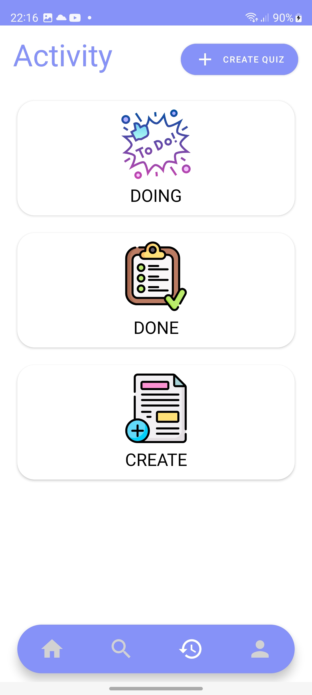

# quiz-app
Quiz app android using Java

Database - SQLite:

Basic function:
- Login, Register, Forgot Password (using Firebase)
- CRUD Quiz
- Show Category, Learning Object
- Search Learning Object by title
- Check history Quiz done, doing, created
- Show User Profile 
- Update User Profile
- Upgrade User achievement 
- Do Quiz (random quiz and answer)
- Show result

